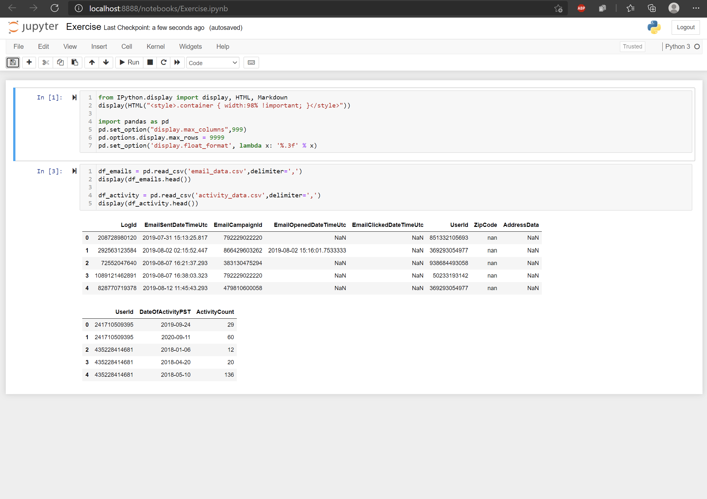

# Data Science Intern Take Home Project

## Purpose
The goal of this project help us understand your data science abilities.
We are providing you real datasets to explore which are drawn from FieldLevel applications.
We do not expect you to spend more than an hour completing the exercise.

To complete the goal you should setup your system as described below and then edit the file Exercise.ipynb in a web browser using jupyter notebooks.

## Setup
#### Get the data and project code
1. Import the exercise repository to your personal Github account. Using github's import tool (https://github.com/new/import) import this url: https://github.com/FieldLevel/fieldlevel-datascience-internship-take-home
1. Invite Dare's github user "dhunt-fieldlevel" to be a collaborator on your new repository
1. Get your new repository on your local machine
1. Unzip the data stored in `data.zip` to the project root. You should see two files, `email_data.csv` and `activity_data.csv`  

#### Run the programming environment
Before you start the exercise you'll need to get python 3 running and a jupyter server notebook.
The fastest way to do that on my mac was:

1. Install anaconda (https://docs.anaconda.com/anaconda/install/)
1. Navigate to repository in a console
1. Run `jupyter notebook`
1. Open webrowser (if it didn't open automatically) and navigate to http://localhost:[8888]/notebooks/Exercise.ipynb where [8888] is the port jupeter is running on.
1. Import the pandas library into the the first cell of the jupyter notebook and then load the datasets `email_data.csv` and `activity_data.csv` via the read csv function. The datasets are comma `,` delimited. 
Display the head of the dataframes. 
If you see something that looks like this you are setup and ready to start the exercise:

## Exercise
In this exercise we imagine you are working as the data analyst on a product team along side a product manager, developers, and designers. 
The team is looking to improve features related to the emails we send to our users.
To that end, the team is thinking it would be good for you review data related to emails we have been sending lately. 
They hope you will be able to answer some basic questions the group brainstormed at the project kickoff.

### About the datasets
Before you start your analysis, first review the descriptions of the datasets below to make sure you understand the data. If you have any questions about the meaning of a column contact us.
#### Dataset: email_data.csv
This is dataset contains samples of the emails we sent.
Each row represents an email that was sent to a user.
This dataset represents a small fraction of the emails we have sent over the time period spanned by the samples.

Column Name | Description
--- | ---
LogId | A unique number used to represent each individual email that was sent
EmailSentDateTimeUtc | The date and time the email was sent in coordinated universal time
EmailCampaignId | A unique number used to represent each email campaign. Multiple users can receive emails multiple times from the same email campaign.
EmailOpenedDateTimeUtc | The date and time the email was opened in coordinated universal time (UTC). Null if the user did not open the email
EmailClickedDateTimeUtc | The date and time in coordinated universal time (UTC) the 'call to action' button or link in the email was clicked by the user. Null if the user did not click anything in the email.
UserId | A unique number used to represent each user. The number is assigned in ascending order as users register at FieldLevel, e.g. the x < y implies x registered before y.
AddressData | A string in JSON format. May be null as not all users have provided an address. The field contains the 5 digit zip code of an address the user provided. Note the format of the JSON object varies. A zipcode will always be identified by the key 'ZipCode'. Some 'ZipCode' keys are duplicated. Some have null values. Some are preceeded by extranious letters.

#### Dataset: activity_data.csv
This is dataset contains a daily log of user activity. If any user represented in the email_data was active on a day during the period covered by the email there will be a row in activity_data. If no row is present for a given UserId and date, you can assume that UserId was not active on that date. 

Column Name | Description
--- | ---
UserId | A unique number used to represent each user that is assigned in ascending order as users register at FieldLevel
DateOfActivityPST | A date a user made an authenticated request to our servers in pacific standard time (PST).
ActivityCount | The number of pages/requests the user made on that day. Users who spend more time on FieldLevel have a higher activity count.

### Questions
For each question below create a new code cell in the Exercise.ipynb notebook. 
Start the code cell with a comment indicating the question it is answering. 
Write any assumptions you made about the data.
Write and execute the code you feel is required to answer the question.
Show your work and describe your thought process.
1. How many rows are in the two datasets? 
If the log of emails represents 3% of the emails we sent over this period, how many emails did we send?
(use python to print the numbers and display them nicely with commas)
1. What are the earliest and most recent dates of emails sent in this dataset in California time (Pacific Standard Time Zone)? (use python to print the date in format mm/dd/yyy hour:minute in 24 hour time)
1. Which 10 zip codes receive the most emails and how many emails do they receive?
1. Plot two lines on a single graph. 
    - total distinct users who were sent at least 1 email by month and year.
    - the monthly percentage of users who were sent an email and were active the same day
